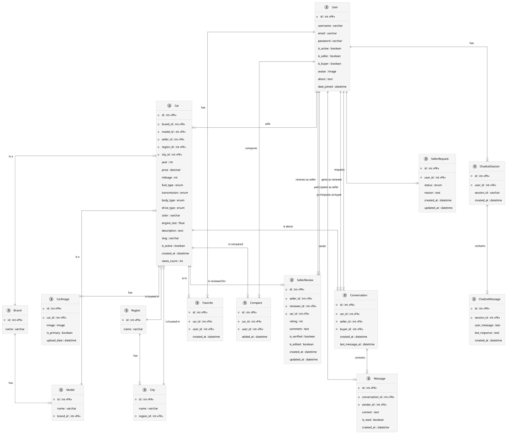

# Entity-Relationship Diagram for Dongelek Car Marketplace

This document presents the ER diagram for the Dongelek car marketplace application, showing the relationships between different entities in the system.

## ER Diagram



## Entity Descriptions

### User
Represents users of the system, who can be buyers, sellers, or both.

### Brand and Model
Represents car brands and their associated models.

### Region and City
Geographic locations where cars are available.

### Car
The main entity representing a car listing with all its details.

### CarImage
Images associated with car listings, with one designated as primary.

### Favorite
Tracks which cars are favorited by which users.

### Compare
Tracks which cars are selected for comparison by which users.

### Conversation
Represents a conversation between a buyer and seller regarding a specific car.

### Message
Individual messages within a conversation.

### SellerReview
Reviews given to sellers by buyers who have interacted with them.

### SellerRequest
Requests from users to become sellers.

### ChatbotSession and ChatbotMessage
Tracks user interactions with the chatbot assistant.
```

## Database Schema Information

This ER diagram captures the main entities and relationships in the Dongelek car marketplace system. The database schema is designed to support:

1. User management (buyers and sellers)
2. Car listing management
3. Location-based filtering
4. Messaging between users
5. Favoriting and comparing cars
6. Rating and reviewing sellers
7. Seller application process
8. AI chatbot assistance
