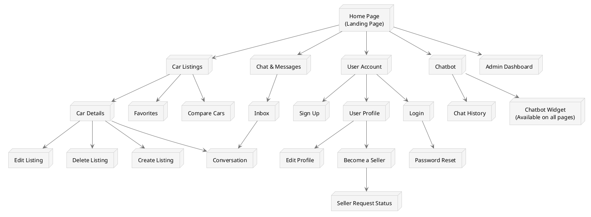

# Dongelek Car Marketplace Site Map

This document presents the site map for the Dongelek car marketplace, showing the structure and organization of the website's pages and features.

## Site Map Visualization

## Page Descriptions

### Home Page
- Features hero section with search form
- Featured/recent car listings
- Quick statistics (number of cars, users, etc.)
- Introduction to site features

### Car Listings
- Searchable and filterable list of all available cars
- Filter by brand, model, year, price range, location, etc.
- Sort options (newest, price low-high, etc.)
- Pagination for large result sets

### Car Details
- Comprehensive information about a specific car
- Image gallery/carousel
- Technical specifications
- Seller information
- Contact seller button
- Action buttons (favorite, compare)
- Related/similar cars

### User Account Pages
- **Login**: User authentication
- **Sign Up**: New user registration
- **Password Reset**: Recover forgotten passwords
- **Profile**: View user profile and statistics
- **Edit Profile**: Update profile information and settings
- **Become a Seller**: Apply for seller privileges
- **Seller Request Status**: Check application status

### Favorite & Compare Features
- **Favorites**: List of cars marked as favorites by the user
- **Compare**: Side-by-side comparison of selected cars

### Chat System
- **Inbox**: All user conversations
- **Conversation**: Individual chat thread with another user about a specific car

### Chatbot Assistant
- **Widget**: Accessible from any page for quick assistance
- **History**: View past interactions with the chatbot

### Seller Features
- Create, edit, and delete car listings
- Respond to buyer inquiries
- View statistics on listings (views, favorites, etc.)

### Admin Dashboard
- User management
- Car listing moderation
- Seller request approval
- System statistics and monitoring

## User Flows

### Buyer Flow
1. Browse car listings
2. Filter and search for desired cars
3. View car details
4. Add interesting cars to favorites or compare list
5. Contact seller about a specific car
6. Negotiate and complete transaction offline

### Seller Flow
1. Apply for seller status
2. Create car listings with details and images
3. Manage existing listings
4. Respond to buyer inquiries
5. Complete transactions offline

### Chatbot Assistance
Available at any point in the user journey to provide help with:
- Navigating the site
- Finding specific cars
- Understanding car specifications
- Learning about the buying/selling process
